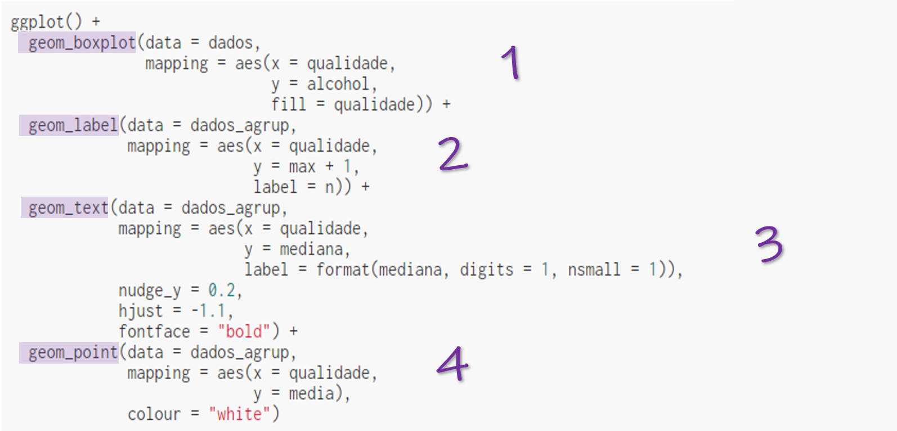
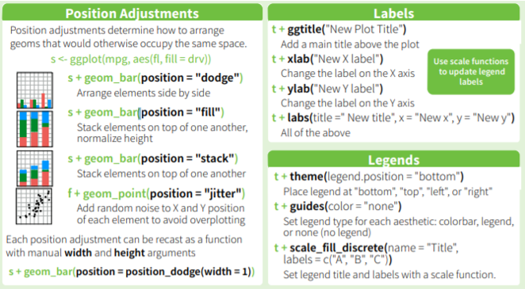

```{r pacotes_e_dados, include=FALSE}
library(ggplot2)
library(dplyr)
library(janitor)
library(extrafont)
loadfonts()

# Carrega os dados 
dados <- read.csv2("./data/winequality-red.csv", sep = ',', dec = '.') %>% 
  clean_names() %>% 
  mutate(qualidade = if_else(quality <= 3, "Ruim", 
                             if_else(quality > 3 & quality < 7, "Normal", "Bom")))

# Renomeando a variável ph
names(dados)[names(dados) == 'p_h'] <- 'ph'

# Dados Agrupados

dados_agrup <- dados %>% 
  dplyr::group_by(qualidade) %>% 
  dplyr::summarise(n = n(),
                   max = max(alcohol),
                   mediana = median(alcohol),
                   media = mean(alcohol)) %>% 
  dplyr::ungroup()


# Faz o boxplot inicial 
primeiro_boxplot <- ggplot() + 
  geom_boxplot(data = dados, 
               mapping = aes(x = qualidade,
                             y = alcohol,
                             fill = qualidade)) +
  geom_label(data = dados_agrup,
             mapping = aes(x = qualidade,
                           y = max + 1,
                           fill = qualidade,
                           label = n),
             size = 5,
             family= "Ink Free",
             fontface = "bold",
             hjust = "middle") + 
  geom_text(data = dados_agrup,
            mapping = aes(x = qualidade,
                          y = mediana,
                          label = format(mediana, digits = 1, nsmall = 1)),
            nudge_y = 0.4,
            hjust = -1.0,
            size = 5,
            family= "Ink Free",
            fontface = "bold") + 
  geom_point(data = dados_agrup,
             mapping = aes(x = qualidade,
                           y = media),
             colour = "white")

```


class: inverse, center, middle

# GGPLOT2

---

# ggplot2

Existem diversas formas de fazer gráficos no R

Uma delas é utilizando o pacote **_ggplot2_**


### Por que usar esse pacote? 

+ faz gráficos elegantes
+ muito versátil
+ implementa a "gramática dos gráficos" 


--

# Instalação

```{r eval=FALSE, tidy=FALSE}
install.packages("ggplot2")
library(ggplot2)
```

---
class: middle

# "Gramática dos Gráficos" 

* É uma ferramenta que permite descrever os componentes de um gráfico

* Um [artigo](http://vita.had.co.nz/papers/layered-grammar.pdf) propôs uma parametrização alternativa dessa gramática

* Traz a ideia de construir um gráfico a partir de várias **camadas de dados**

* As ideias desse artigo foram implementadas no **_ggplot2_**

---

# Como construir um gráfico?

### Dados

[Base de dados](https://www.kaggle.com/uciml/red-wine-quality-cortez-et-al-2009) de características de vinhos (acidez, densidade, % álcool, qualidade)

--

### Mapear o que queremos plotar

  * qual variável queremos colocar no eixo x?
  * qual variável queremos colocar no eixo y?
  
--

### Definir qual o objeto geométrico queremos criar

  * ponto?
  * linha?
  * barras?

--

### ... Melhorar a estética

---

# Estrutura Básica do ggplot2

--

#### Dados 

```{r eval=FALSE, tidy=FALSE}
* ggplot(data = [SUA BASE DE DADOS],
       mapping = aes(x = [VARIÁVEL DO EIXO X],
                     y = [VARIÁVEL DO EIXO Y]))) + 
  geom_[OBJETO]
```

--

#### Variáveis 

```{r eval=FALSE, tidy=FALSE}
ggplot(data = [SUA BASE DE DADOS],
*      mapping = aes(x = [VARIÁVEL DO EIXO X],
*                    y = [VARIÁVEL DO EIXO Y]))) + 
  geom_[OBJETO]
```

--

#### Objeto geométrico

```{r eval=FALSE, tidy=FALSE}
ggplot(data = [SUA BASE DE DADOS],
       mapping = aes(x = [VARIÁVEL DO EIXO X],
                     y = [VARIÁVEL DO EIXO Y]))) + 
*  geom_[OBJETO]
```

---

### Gráfico de dispersão do ph dos vinhos contra a acidez fixa

```{r eval=FALSE, tidy=FALSE}
ggplot(data = dados,
       mapping = aes(x = ph, 
                     y = fixed_acidity)) + 
  geom_point()
```

--

```{r echo=FALSE, fig.align='center', fig.dim=c(7,6)}
ggplot(data = dados,
       mapping = aes(x = ph, 
                     y = fixed_acidity)) + 
  geom_point()
```

---

# Objetos Geométricos

- Gráficos de dispersão: `geom_point()`

- Gráficos de barras: `geom_col()` ou `geom_bar()`

- Gráficos de linhas: `geom_line()`

- Histograma: `geom_hist()`

- Boxplot: `geom_boxplot()`

- Densidade: `geom_density()`

- Suavização: `geom_smooth()`

- Adicionar rótulos ou textos: `geom_label()` ou `geom_text()`

---

## Parâmetros dos Objetos Geométricos

Todos esses objetos geométricos possuem elementos estéticos. Por exemplo:

### geom_point()

Os parâmetros disponíveis são:

- **x**: variável do eixo x
- **y**: variável do eixo y 
- **alpha**: controla a transparência dos pontos
- **colour**: define a cor dos pontos 
- **fill**: define a cor de preenchimento dos pontos
- **group**: agrupa os dados por outra variável
- **shape**: define o formato dos pontos
- **size**: define o tamanho dos pontos
- **stroke**: define o tamanho da borda dos pontos

[Saiba mais sobre o geom_point()](https://ggplot2.tidyverse.org/reference/geom_point.html)

---

### Gráfico de dispersão do ph dos vinhos contra a acidez fixa
Vamos contornar os pontos e mudar o formato de acordo com a qualidade do vinho

```{r eval=FALSE, tidy=FALSE}
ggplot(data = dados) + 
  geom_point(mapping = aes(x = ph, 
                           y = fixed_acidity,
*                          colour = factor(qualidade),
*                          shape = factor(qualidade))
```

--

```{r echo=FALSE, fig.align='center', fig.dim=c(8,5)}
ggplot(data = dados) + 
  geom_point(mapping = aes(x = ph, 
                           y = fixed_acidity,
                           colour = factor(qualidade),
                           shape = factor(qualidade)))
```


---
class: inverse, middle, center

# Vamos fazer um exemplo colocando mais algumas camadas?

--

1. Fazer um boxplot da variável _alcohol_ pela variável Qualidade

--

2. Adicionar uma **camada** com a quantidade de vinhos em cada Qualidade

--

3. Adicionar uma **camada** que exibe o valor da mediana como texto

--

4. Adicionar uma **camada** que mostra o valor da média como um ponto no gráfico

---
class: middle, center

**Obs:** para colocar as medidas (tamanho do grupo, mediana e média) no gráfico, criei uma outra base chamada **dados_agrup**

--



---
class: middle

# Resultado ... 

```{r echo=FALSE, fig.align='center', fig.dim=c(10,7)}
ggplot() + 
  geom_boxplot(data = dados, 
               mapping = aes(x = qualidade,
                             y = alcohol,
                             fill = qualidade)) +
  geom_label(data = dados_agrup,
             mapping = aes(x = qualidade,
                           y = max + 1,
                           label = n)) + 
  geom_text(data = dados_agrup,
            mapping = aes(x = qualidade,
                          y = mediana,
                          label = format(mediana, digits = 1, nsmall = 1)),
            nudge_y = 0.2,
            hjust = -1.1,
            fontface = "bold") + 
  geom_point(data = dados_agrup,
             mapping = aes(x = qualidade,
                           y = media),
             colour = "white")
```

---
class: inverse, middle

### Já sabemos fazer um gráfico simples   😄

### E agora já sabemos como adicionar mais camadas    😄

--

# Como mexer no estilo do gráfico ? 
# Como deixar ele dentro do padrão da apresentação, por exemplo?

---

### Quase tudo no **ggplot2** pode ser modificado. 

Existe uma folhinha de _"cola"_ ([cheatsheet](https://www.rstudio.com/wp-content/uploads/2015/03/ggplot2-cheatsheet.pdf)) que nos motra todos os parâmetros que podemos adicionar em cada um dos objetos geométricos.  
Ela também mostra que podemos alterar o título do gráfico, título dos eixos, podemos alterar as cores. Uma infinidade de alterações podem ser feitas nas camadas. 

.center[

]

---

### Quais as camadas de estilo que eu mais uso ???

`labs()`: essa **camada** altera o título do gráfico, o título do eixo y, e título do eixo x.
```{r eval=FALSE, tidy=FALSE}
grafico + 
  labs(title = "Título do meu gráfico",
       x = "Título do meu eixo x",
       y = "Título do meu eixo y")
```

`scale_fill_brewer()`: essa **camada** altera as cores do `fill` que acrescentamos no boxplot, por exemplo:
```{r eval=FALSE, tidy=FALSE}
grafico + 
  scale_fill_brewer(name = "Qualidade", palette = "Purples")
```

`theme_bw()`, `theme_minimal()`, `theme_classic()`: essa **camada** altera o tema do gráfico:
```{r eval=FALSE, tidy=FALSE}
grafico + 
  theme_bw()
```

---

# theme()

Essa camada é uma forma de customizar os componentes do seu gráfico que não envolvem os dados. Por exemplo: fonte do título, tamanho do título, cor dos textos, tamanho da legenda, etc...  
Normalmente, é a camada que eu deixo por último!

### O que você consegue alterar com essa camada?

* **plot.title**: título do gráfico (fonte, tamanho, cor, posição)
* **axis.title**: título dos eixos (fonte, tamanho, cor, posição)
* **legend.background**: cor do fundo da legenda

Se quiser ver tudo que é possível ser alterado, só clicar nesse [link aqui](https://ggplot2.tidyverse.org/reference/theme.html)!

---

# Vamos deixar aquele boxplot mais bonito?

```{r eval=FALSE, tidy=FALSE}
primeiro_boxplot + 
  # Alterando os títulos
  labs(title = "Boxplot Percentual Alcóolico x Qualidade do vinho",
       x = "Qualidade do Vinho",
       y = "(%) Álcool") + 
  
  # Alterando a cor para roxo
  scale_fill_brewer(name = "Qualidade", palette = "Purples") + 
  
  # Alterando o tema
  theme_bw() + 
  
  # Alterando fontes e tamanhos ... 
  theme(plot.title = element_text(family = "Ink Free", 
                                  size = 20,
                                  face = "bold",
                                  colour = "#562457",
                                  hjust = 0.5),
        text = element_text(family = "Ink Free"),
        axis.title = element_text(size = 17, face = "bold"),
        axis.text = element_text(size = 15, face = "bold"),
        legend.text = element_text(size = 15, face = "bold"),
        legend.title = element_text(size = 17, face = "bold"))
```


---

### Resultado ...

```{r echo=FALSE, fig.align='center', fig.dim=c(10,7)}
primeiro_boxplot + 
  labs(title = "Boxplot Percentual Alcóolico x Qualidade do vinho",
       x = "Qualidade do Vinho",
       y = "(%) Álcool") + 
  scale_fill_brewer(name = "Qualidade", palette = "Purples") + 
  theme_bw() + 
  theme(plot.title = element_text(family = "Ink Free", 
                                  size = 21,
                                  face = "bold",
                                  colour = "#562457",
                                  hjust = 0.5),
        text = element_text(family = "Ink Free"),
        axis.title = element_text(size = 18, face = "bold"),
        axis.text = element_text(size = 16, face = "bold"),
        legend.text = element_text(size = 16, face = "bold"),
        legend.title = element_text(size = 18, face = "bold"))

```

---

class: inverse, middle, center


# Obrigada!

Slides criados usando o pacote [**xaringan**](https://github.com/yihui/xaringan).

Todo o material está disponível no [**github!**]()

Siga as RLadies SP no [**instagram**](https://instagram.com/rladiessaopaulo?igshid=1ij2ofwaxkr2q)  😄 


